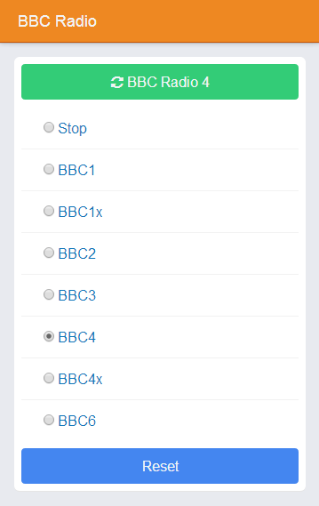

raspberry-radio
===============

Scripts and a simple webserver for playing BBC radio stations on a Raspberry Pi (or other linux systems).

See [INSTALL.md](./INSTALL.md) for installation instructions.

See [Stephen's blog](http://blog.scphillips.com) for articles about this, in particular, 
[BBC Radio on the Raspberry Pi controlled with a tiny web server](http://blog.scphillips.com/2014/12/bbc-radio-on-the-raspberry-pi-controlled-with-a-tiny-web-server/).

Scripts and software are copyright Stephen C Phillips and licensed under [GPL v3](./LICENSE) unless otherwise noted.

Third party licenses:
* [jQuery](http://jquery.com/), v1.11.1, MIT License
* [Font Awesome](http://fortawesome.github.io/Font-Awesome/), v4.1.0, MIT License
* [Font Awesome font](http://fortawesome.github.io/Font-Awesome/), v4.1.0, [SIL OFL 1.1](http://scripts.sil.org/OFL)
* [App.js](http://code.kik.com/app/2/index.html), v2.0.2, MIT License